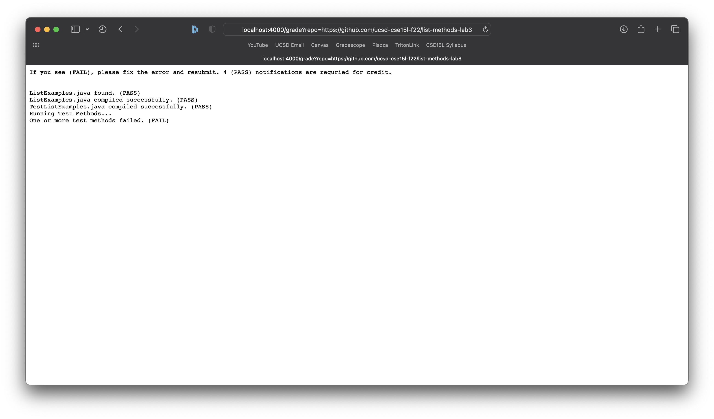
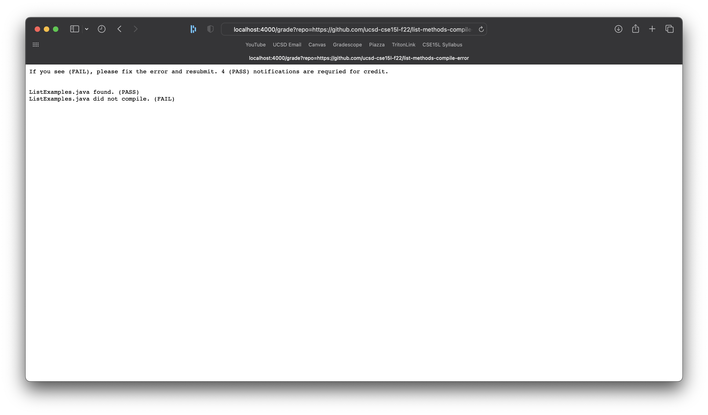

# CSE 15L Lab Report Gradescript
## Peyton Gaudet (A17573280)

**Part 1: Testing on given repositories**

1. list-methods-lab3


2. list-methods-corrected


3. list-methods-compile-error


**Part 2: Tracing the Script**

My grade.sh script:
```
set -e

echo "If you see (FAIL), please fix the error and resubmit. 4 (PASS) notifications are requried for credit."
echo ""
echo ""

#1. Clone the repository
rm -rf combine
rm -rf student-submission
git clone $1 student-submission > dontneed.txt 2> dontneed2.txt

#2. Check if file exists
cd student-submission
if [[ -e "ListExamples.java" ]]
then
    echo "ListExamples.java found. (PASS)"
else 
    echo "ListExamples.java not found. (FAIL)"
    exit 1
fi

#3 Get student code and test into same directory
cd ..
mkdir combine

cd student-submission
cp ListExamples.java /Users/peyton/Documents/GitHub/list-examples-grader/combine/

cd ..
cp TestListExamples.java /Users/peyton/Documents/GitHub/list-examples-grader/combine/

rm /Users/peyton/Documents/GitHub/list-examples-grader/student-submission/ListExamples.java

#4 Compile tests and student code
cd combine
set +e

javac ListExamples.java 2> compileLE.txt
if [[ $? -eq 0 ]]
then
    echo "ListExamples.java compiled successfully. (PASS)"
else
    echo "ListExamples.java did not compile. (FAIL)"
    exit 1
fi

javac -cp .:../lib/hamcrest-core-1.3.jar:../lib/junit-4.13.2.jar TestListExamples.java 2> compileTLE.txt
if [[ $? -eq 0 ]]
then
    echo "TestListExamples.java compiled successfully. (PASS)"
    echo "Running Test Methods..."
    java -cp .:../lib/hamcrest-core-1.3.jar:../lib/junit-4.13.2.jar org.junit.runner.JUnitCore TestListExamples > feedback.txt    
    
    #5 Give feedback based on tests
    grep "OK" feedback.txt > dontneed3.txt
    if [[ $? -eq 0 ]]
    then
        echo "Test methods were successful. (PASS)"
    else
        echo "One or more test methods failed. (FAIL)"
    fi
else
    echo "TestListExamples.java did not compile. (FAIL)"
    exit 1
fi
```

* Note: 1) will be for stdout, 2) will be for stderr, 3) will be for exit code. X will represent no output.

**set -e**

1. X
2. X
3. 0

**echo "If you see (FAIL), please fix the error and resubmit. 4 (PASS) notifications are requried for credit."**
1. If you see (FAIL), please fix the error and resubmit. 4 (PASS) notifications are requried for credit.
2. X
3. 0

**echo ""**
1. 
2. X
3. 0

**echo ""**
1. 
2. X
3. 0

**rm -rf combine**
1. X
2. X
3. 0

**rm -rf student-submission**
1. X
2. X
3. 0

**git clone $1 student-submission**
1. X
2. Cloning into 'student-submission'...
warning: unable to access '/Users/peyton/.config/git/ignore': Permission denied
warning: unable to access '/Users/peyton/.config/git/attributes': Permission denied
3. 0

**cd student-submission**
1. X
2. X
3. 0

*if [[ -e "ListExamples.java" ]] The condition is TRUE because ListExamples.java was found. Only the THEN part of this IF statement executes in this case and the ELSE part is ignored.*

**echo "ListExamples.java found. (PASS)"**
1. ListExamples.java found. (PASS)
2. X
3. 0

**cd ..**
1. X
2. X
3. 0

**mkdir combine**
1. X
2. X
3. 0

**cd student-submission**
1. X
2. X
3. 0

**cp ListExamples.java /Users/peyton/Documents/GitHub/list-examples-grader/combine/**
1. X
2. X
3. 0

**cd ..**
1. X
2. X
3. 0

**cp TestListExamples.java /Users/peyton/Documents/GitHub/list-examples-grader/combine/**
1. X
2. X
3. 0

**rm /Users/peyton/Documents/GitHub/list-examples-grader/student-submission/ListExamples.java**
1. X
2. X
3. 0

**cd combine**
1. X
2. X
3. 0

**set +e**
1. X
2. X
3. 0

**javac ListExamples.java**
1. X
2. X
3. 0

*if [[ $? -eq 0 ]] The condition is TRUE because the previous command executed with error code 0 (The file compiled). Only the THEN part of this IF statement is executed and the ELSE part is ignored.*

**echo "ListExamples.java compiled successfully. (PASS)"**
1. ListExamples.java compiled successfully. (PASS)
2. X
3. 0

**javac -cp .:../lib/hamcrest-core-1.3.jar:../lib/junit-4.13.2.jar TestListExamples.java**
1. X
2. X
3. 0

*if [[ $? -eq 0 ]] The condition is TRUE because the previous command executed with error code 0 (The tests compiled). Only the THEN part of this IF statement is executed and the ELSE part is ignored.*

**echo "TestListExamples.java compiled successfully. (PASS)"**
1. TestListExamples.java compiled successfully. (PASS)"
2. X
3. 0

**echo "Running Test Methods..."**
1. Running Test Methods...
2. X
3. 0

**java -cp .:../lib/hamcrest-core-1.3.jar:../lib/junit-4.13.2.jar org.junit.runner.JUnitCore TestListExamples**
1. JUnit version 4.13.2 \n
. \n
Time: 0.002 \n
OK (1 test)
2. X
3. 0

**grep "OK" feedback.txt**
1. OK (1 test)
2. X
3. 0

*if [[ $? -eq 0 ]] The condition is TRUE because the previous command executed with error code 0 ("OK" was found). Only the THEN part of this IF statement is executed and the ELSE part is ignored.*

**echo "Test methods were successful. (PASS)**
1. Test methods were successful. (PASS)
2. X
3. 0
