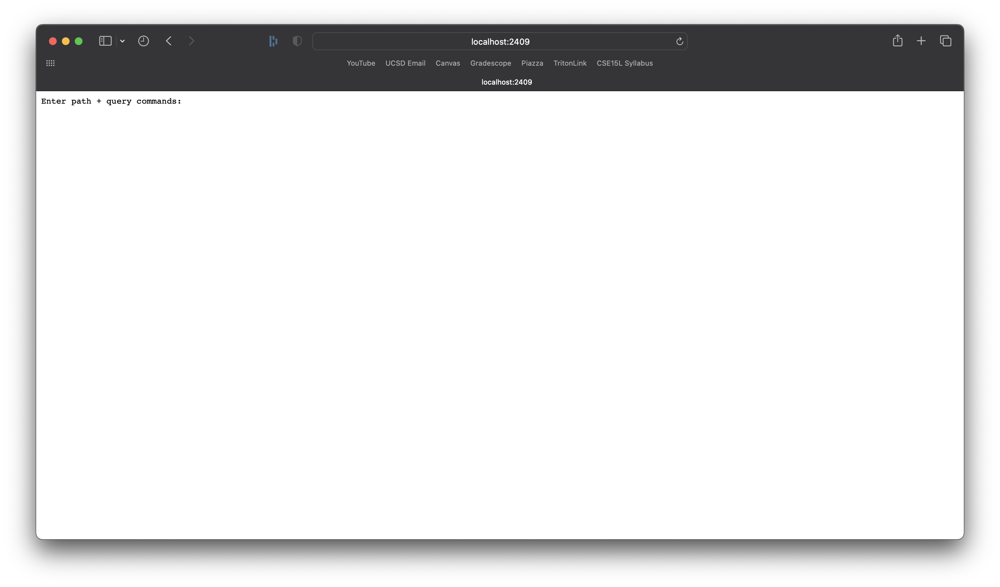
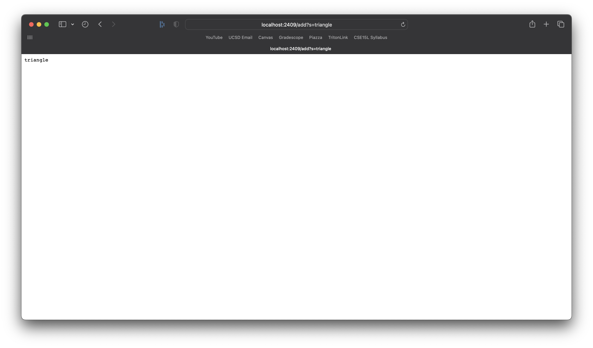
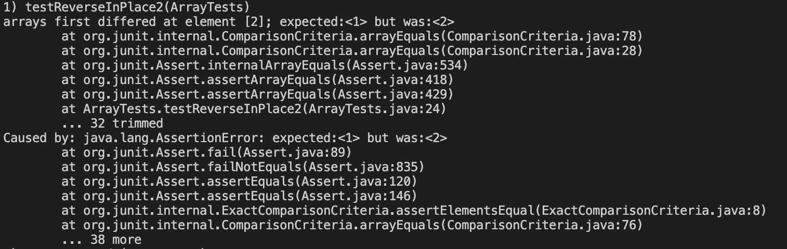
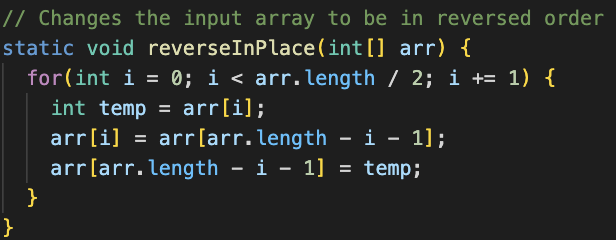
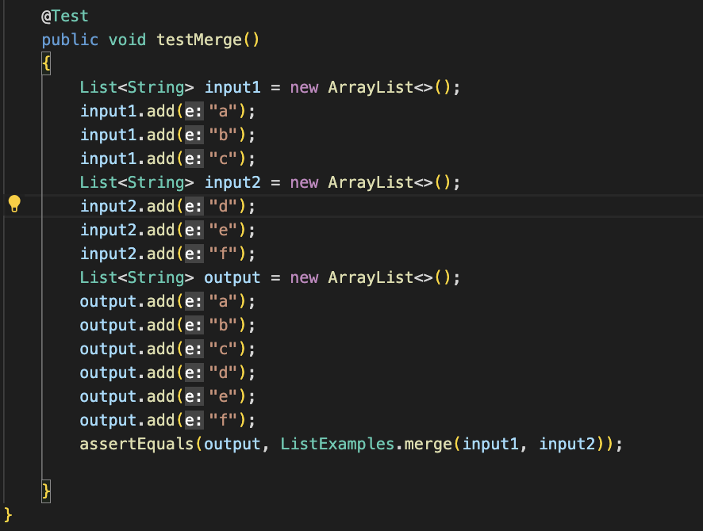
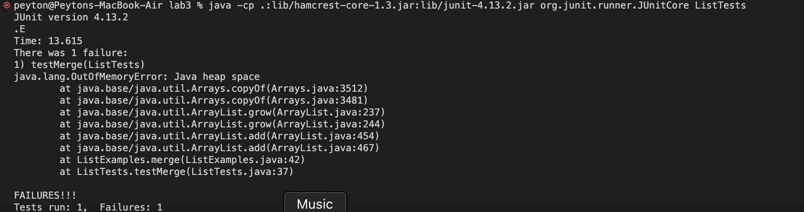
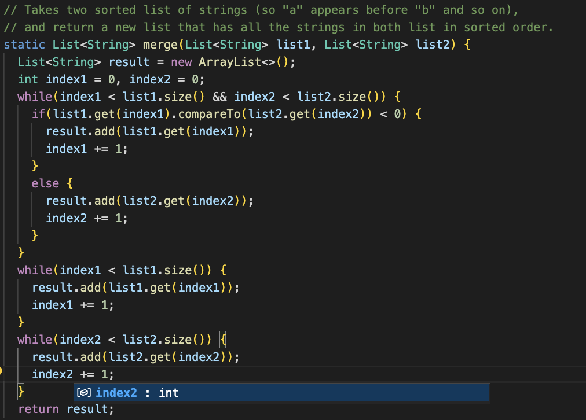

# CSE 15L Lab Report 2
## Peyton Gaudet (A17573280)

---
**Part 1: Simplest Search Engine** 

SearchEngine.java code:
```
import java.io.IOException;
import java.net.URI;
import java.util.*;

class Handler implements URLHandler 
{
    // The one bit of state on the server: a number that will be manipulated by
    // various requests.
    public String handleRequest(URI url) 
    {
        ArrayList<String> s1 = new ArrayList<String>();
        
        if (url.getPath().equals("/add")) 
        {
            String[] parameters = url.getQuery().split("=");
            if(parameters[0].equals("s"))
            {
                s1.add(parameters[1]);
            }
            for (String s : s1)
            {
                return s;
            }
        } 
        
        else if (url.getPath().equals("/search")) 
        {
            String[] parameters = url.getQuery().split("=");
            if(parameters[0].equals("s"))
            {
                ArrayList<String> s2 = new ArrayList<>();
                for (String s : s1)
                {
                    if(s.contains(parameters[1]))
                    {
                        s2.add(s);
                    }                     
                }
                
                String ret = "";

                for(String s : s2)
                {
                    ret = ret + " " + s;
                }
                return ret;
            }    
        } 
        return "404 Not found";
    }
}
class StringServer 
{
    public static void main(String[] args) throws IOException 
    {
        if(args.length == 0)
        {
            System.out.println("Missing port number! Try any number between 1024 to 49151");
            return;
        }

        int port = Integer.parseInt(args[0]);

        Server.start(port, new Handler());
    }
}
```







**Part 2: Debugging**

1. reverseInPlace()
* Failure-Inducing Input: With the input array being {1, 3, 2}, we expect to have a resulting array of {2, 3, 1}.

* Symptom: The symptom occurred at the element at index 2 where it was supposed to be a 1 but instead we got 2. It says that there was an array in our assertion because our exepcted value and actual value did not match.

* Bug:
The bug was that the array was getting edited without saving the original values. So, arr[0] would get changed but that value was needed in order to make a swap at the end. The fix is below:



2. merge()
* Failure-Inducing Input: With the first input array being {a, b, c} and the second input array being {d, e, f}, we expect to have a resulting array after running the merge method of {a, b, c, d, e, f}

* Symptom: The symptom was an infinite loop and would have occured for near all inputs. The terminal output tells us that the program caused us to run out of memory and it took 13.615 seconds to execute. For such a small program that should not be the case and it seems clear from the error message and time that an infinite loop occured.

* Bug: The bug in the program was in the last while loop of the merge method. Instead of incrementing index2, index1 was incremented. This caused index2 to never be greater the list2.size() and therefore, the while loop was never broken. The fix is below:
