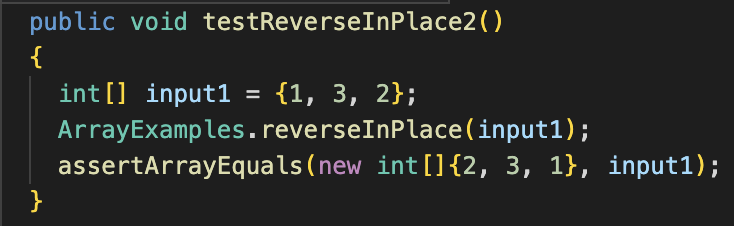

# CSE 15L Lab Report 2
## Peyton Gaudet (A17573280)

---
**Part 1: Simplest Search Engine** 

SearchEngine.java code:
```
import java.io.IOException;
import java.net.URI;
import java.util.*;

class Handler implements URLHandler 
{
    // The one bit of state on the server: a number that will be manipulated by
    // various requests.
    ArrayList<String> s1 = new ArrayList<String>();

    public String handleRequest(URI url) 
    {       
        if (url.getPath().contains("/add")) 
        {
            String[] parameters = url.getQuery().split("=");
            if(parameters[0].equals("s"))
            {
                s1.add(parameters[1]);
                return String.format("%s", parameters[1]);
            }
        } 
        
        else if (url.getPath().contains("/search")) 
        {
            String[] parameters = url.getQuery().split("=");
            if(parameters[0].equals("s"))
            {
                ArrayList<String> s2 = new ArrayList<>();
                for (String s : s1)
                {
                    if(s.contains(parameters[1]))
                    {
                        s2.add(s);
                    }                     
                }
                
                String ret = "";
                for(String s : s2)
                {
                    ret = ret + " " + s;
                }
                return ret;
                
            }    
        } 
        return "Enter path + query commands:";
    }
}
class StringServer 
{
    public static void main(String[] args) throws IOException 
    {
        if(args.length == 0)
        {
            System.out.println("Missing port number! Try any number between 1024 to 49151");
            return;
        }

        int port = Integer.parseInt(args[0]);

        Server.start(port, new Handler());
    }
}


```

1. With no path or query after the url, the website returns "Enter path + query commands:". With this input, the only methods being used are the handleRequest() method which does not go inside the if or else if statements, returning the last statement which appears on the page. The main method checks if there's a port number given as an argument in the terminal and starts the server.


2. With the path "add" and the query "triangle" more methods are being used inside the "if" statement in the handleRequest() method. First the getQuery() method is used and split() is used to split the query on both sides of the equal sign into parameters. With this, we can check that the first parameter is "s" using the equals() method indicating a String and add the second parameter to an ArrayList using the add() method with whatever String the user inputs. Again, the main method checks if there's a port number given as an argument in the terminal and starts the server.


3. With the path "search" and the query "angle" a couple more methods are being used inside the "else if" statement in the handleRequest() method. Again, the getQuery() method is used and split() is used to split the query on both sides of the equal sign into parameters and the first parameter is used with the equals() method to see if it is "s" which indicates a String. The second parameter this time is used in the contains() method to see if there is matching substring within the words that were put into the original ArrayList using the "add" path. If there is, that word is returned. Here, rectangle, triangle, and square were added to the ArrayList and after using the "search" path and "angle" query, triangle and rectangle were returned. The main method checks if theres a port number given as an argument in the terminal and starts the server. *Triangle gets returned twice because it was added twice.*


**Part 2: Debugging**

1. reverseInPlace()
* Failure-Inducing Input: With the input array being {1, 3, 2}, we expect to have a resulting array of {2, 3, 1}.

* Symptom: The symptom occurred at the element at index 2 where it was supposed to be a 1 but instead we got 2. It says that there was an array in our assertion because our exepcted value and actual value did not match.

* Bug + Connection:
The bug was that the array was getting edited without storing the original values. So, arr[0] would get changed but that value was needed in order to make a swap at the end. The element at the end of the input array was moved to the front and then at the end, the last element was swapped with the first element. The first element had the same value as the last during this swap it makes sense that the symptom was that the last value was a 2 instead of a 1. The fix is below:
 

2. merge()
* Failure-Inducing Input: With the first input array being {a, b, c} and the second input array being {d, e, f}, we expect to have a resulting array after running the merge method of {a, b, c, d, e, f}.

* Symptom: The symptom was an infinite loop and would have occured for near all inputs. The terminal output tells us that the program caused us to run out of memory and it took 13.615 seconds to execute. For such a small program that should not be the case and it seems clear from the error message and time that an infinite loop occured.

* Bug + Connection: The bug in the program was in the last while loop of the merge method. Instead of incrementing index2, index1 was incremented. This caused index2 to never be greater the list2.size() and therefore, the while loop was never broken. It makes sense that the symptom was a clear infinite loop and that the program took that long to run and that we ran out of memory in the process. The fix is below:
