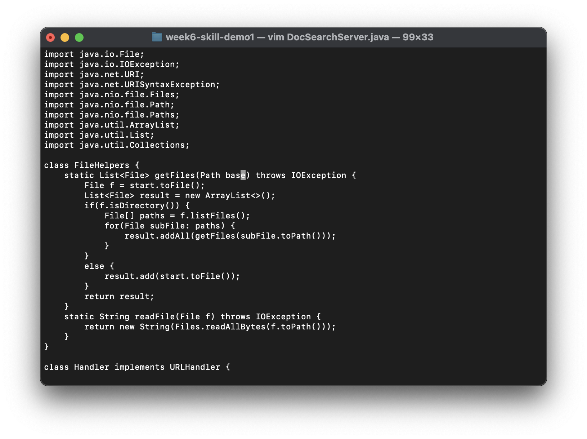

# CSE 15L Lab Report Vim
## Peyton Gaudet (A17573280)

**Part 1: Week 6 Task**

The task I chose to do was the first one where we were asked to change the name of the start parameter and its uses to base. Below are the list of keystrokes along with screenshots I used to complete the task:

* `/start`

I used this command to find the use of start in the getFiles() method. Luckily, this method was at the top and there were no previous uses of start elsewhere so it jumped to the start instance that I needed to change right away.

* `ce`

I used this command to switch into input mode and delete the word start.

* `base <esc>`

While in insert mode and at the correct spot where I needed to change the name of start to base, I simply typed in `base` and pressed `<esc>` to enter back into normal mode.

* `n.n.`

Using the command `n` repeated the last search that I made. So, it found the next instance of start which needed to be changed. The `.` command repeats the previous commands which were explained in steps 2 and 3. There was one more instance of start that needed to get changed to base so we used the same sequence of commands to acheive. Now, our goal is complete.

Using `n`:

Using `.`:

* `:wq`

Since our goal is now completed, we can use the command `:wq` to save our work and quit vim. In total, we used 20 keystrokes to complete our task!

